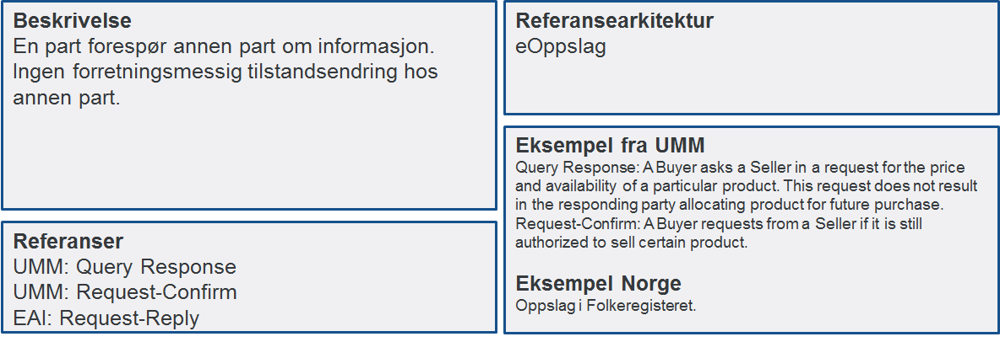

:lang: no
:doctitle: Samhandlingsmønstre
:keywords: samhandlingsmønstre

include::../plattform_felles/includes/commonincludes.adoc[]

//image:../plattform_felles/media/i-arbeid.png[width=45, height=45] 

//image:./media/Samhandlingsevne.png[alt="Samhandlingsevne", width=750]

//== Generelt om samhandlingsmønstre

Digital samhandling mellom virksomheter kan utføres på et begrenset antall måter sett fra et forretningsståsted. Vi kaller dette samhandlingsmønstre. Samhandlingsmønstre sier ikke noe om hvilken teknologi som skal benyttes, men sier noe om hvilke egenskaper samhandlingen skal ha. Kvalitetsegenskaper er dermed innebygd i definisjonen av hvert samhandlingsmønstre.

NOTE: Begrepet _samhandlingsmønster_ tilsvarer begrepet _Business Interaction_; ref. Archimate-standarden. 

Identifiserte samhandlingsmønstre er vist i følgende figur, med angivelse av kvalitetsegenskaper.

//== Samhandlingsmønstre og kvalitetsegenskaper

.Figur: Samhandlingsmønstre og kvalitetsegenskaper
image:../nab_referanse_arkitekturer/media/samhandlingsmønstre-og-kvalitetskrav.png[]

Logisk nedbryting av samhandlingsmønstre fra generelle til mer spesifikke er vist nedenfor. 

NOTE: En slik nedbryting kan brukes for å identifisere løsningsmønster ut fra behov.  

.Figur: Samhandlingsmønstre hierarki 
image:../nab_referanse_arkitekturer/media/samhandlingsmønstre-hierarki.png[]

//Det er til nå identifisert seks forskjellige samhandlingsmønstre.

//Hvert enkelt samhandlingsmønster beskrives i mer detalj under og for hvert samhandlingsmønster pekes det på hvilken referansearkitektur som skal benyttes for samhandlingen.

//image:./media/Mønstre samhandling.png[alt="alt="missing image", width=750]

////
== Beskrivelser av samhandlingsmønstre

//Henrik: Har laget en tabell av det Anne Lise beskrev i epost før sist møte

[cols ="1,1,1,1,1,1", options="header"]
.Oversikt samhandlingsbehov
|===
|
|En kjent kilde
|
|Flere kilder
|
|Store datamengder

|
|Høy oppetid
|Lav oppetid
|Høy oppetid
|Lav oppetid
|

|Sende informasjon
|API-kall
|Meldingsutveksling
|API-kall
|Meldingsutveksling
|

|Innhente informasjon
|API-kall
|Meldingsutveksling
|API-kall
|Meldingsutveksling, Adressetjeneste
|Fildelingstjeneste

|Publisere hendelse
|API-kall, Meldingsutveksling
|Hendelseliste, Meldingsutveksling
|API-kall
|Hendelsesliste
|

|===

=== Forretningstransaksjon mellom to parter

image:./media/Forretningstransaksjon_mellom_to_parter.png[alt="image:./media/Forretningstransaksjon mellom to parter", width=750]

=== Oversende informasjonsendring til informasjonseier

image:./media/Oversende informasjonsendring til informasjonseier.png[alt="bad!", width=750]

=== Oversende informasjon mellom to parter
 
image:./media/Oversende informasjon mellom to parter.png[alt="bad!", width=750]

=== Forespørsel om informasjon – "umiddelbar" respons

=== Notifikasjon til identifisert part
 
image:./media/Notifikasjon til identifisert part.png[alt="Notifikasjon til identifisert part", width=750]

=== Notifikasjon til mange
 
image:./media/Notifikasjon til mange.png[alt="bad!", width=750]

=== Forespørsel om informasjon – ikke "umiddelbar" respons

image:./media/Forespørsel om informasjon uten umiddelbar respons.png[alt="bad!", width=750]
////

