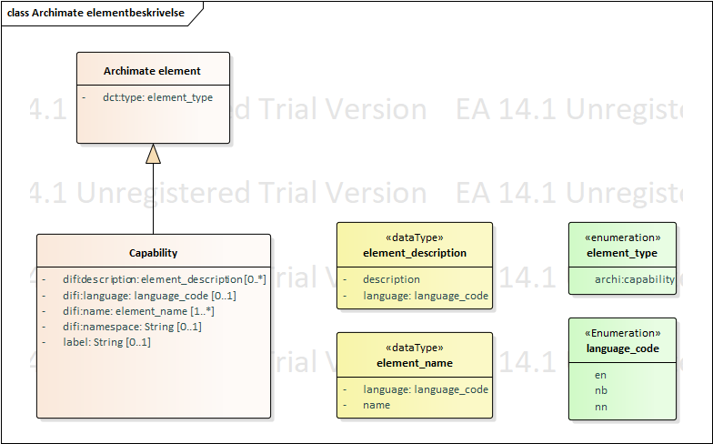

:lang: no
:doctitle: Modelleringskonvensjoner
:keywords: Modelleringskonvensjoner

include::../plattform_felles/includes/commonincludes.adoc[]

image:../plattform_felles/media/i-arbeid.png[width=45, height=45, alt="Figur: i-arbeid.png?",]Uferdig innhold - første versjon er fremdeles i arbeid

== Generelt
Konvensjoner for arkitekturmodellering i aktuelle arkitekturspråk, dvs. primært Archimate, BPMN, UML (dessuten planlagt DMN, CMMN).

Dette inngår i et overordnet sett av dokumentasjonskonvensjoner, der også konvesjonell  tekstlig dokumenntasjon inngår.    

== Modelleringsprinsipper
Her kommer informasjon om styrende prinsipper for modellering.

Foreløpig liste over temaer:

* Kombinasjon av modelleringsspråk
* Tjenesteorientert arkitektur (SOA)
* Viewpoints for målgrupper
* Enhetlig tilnærming på tvers av modelleringsspråk 
* Klart skille mellom abstraksjonnivåer
* Visuelle modeller framfor attributter og tekst

== Grunnleggende begrepsapparat

=== Generelle begreper relatert til modeller 

Modell 
Konsept
Element
Relasjon
Visningsmal (Viewpoint)
Visning (Wiew)

=== Konsepter
Kapabilitet
Funksjon
Prosess
Aktør
Rolle

IT-system
Applikasjon
Infrastruktur
Teknologi

Informasjon
Strukturert informasjon
Ustrukturert informasjon

Data
Dokument

Datasett
Informasonselement

== Navnekonvensjoner (norsk)
=== Generelt
Som hovedregel følges navnkonvensjonene som er gitt i Archimate-standarden. Her gis unntak, presiseringer  og utdyping.

=== Navning av _kapabiliteter_

* [underline]#*Hovedregel:*# Bruk ord som passer inn i setningsmalen: "Rolle/aktør/system må evne å <kapabilitetsnavn>." Dette vil normalt være _verb i infinitiv form_. 
+
Eksempel: En datakonsument må evne å _Innhente data_.

* [underline]#*Unntak:*#
Om det dreier seg om innarbeidede ord som kommuniserer bedre, kan det benyttes ord som passer inn i følgende alternative setningsmal: "Rolle/aktør/system må evne å gjøre <kapabilitetsnavn>". Dette vil normalt være _Verbalsubstantiv_.
+
Eksempel: "En virksomhet må evne å gjøre _Informasjonsforvaltning_". 

TIP: En kan også godt si "En virksomhet må evne å _Forvalte informasjon_". Kommuniserer dette meningen like godt, er det kanskje bedre å bruke? 

NOTE: På engelsk fungerer det bedre   med_Verbalsubstantiv_ enn på norsk. En kan f.eks. godt si _Data reception_ (mens ordet _Datamottaking_ vel ikke finnes på norsk). 

WARNING: _Bestandig angi rolle(aktør/system som innehar, eller bør inneha, aktuell kapabilitet. En kapabilitet i "løse luften" er meningsløs._ 

=== Navning av _prosesser_ 
Hovedregel: Bruk verb i imperativ form.

Eksempel: _Innhent data_.

== Archimate extensions
=== Attributter
Her gis en informasjonsmodell med spesifikasjon av attributter og gyldige verdier for ulike konsepter i Archimate.

==== Generelt (alle konsepter)
name:: Short name, preferably fitting into a typically sized visual element in a diagram; i.e max 30-40 characters. Unless a Label is specified, this will be the name shown for concepts in views/diagrams.
+
Applicability: Models,Folders, Views, Concepts

label:: May be used in order to specify how a _Name_attribute is shown, e.g to insert line breaks or add information about the type of concept. 
+
Applicability: Concepts

difi:source:: Name of person or organization
+
* Applicability: Models; views; folders.

difi:author:: Name of person or organization; with email address.
+
* Applicability: Models; views; folders.

difi:namespace:: May be used in order to allow equally named concepts of the same type.
+
Valid values: Any.

difi:name_no:: Norwegian name (nb or nn).
difi:name_en:: English name
difi:orig_name:: Original name, as coming from the source in question.

difi:orig_name:: Original name, as coming from the source in question.

difi:language:: Gjeldende språk for 
+ 
* Applicability: All
+ 
* Valid values: en, no, nb, nn

difi:default-language:: 
+ 
* Applicability: Model (all views and concepts)
+ 
* Valid values: en, no, nb, nn

difi:current-language*:
+ 
* Valid values: Model (all views and concepts)
+ 
* Valid values: en, no, nb, nn

WARNING: #Følgende figur må oppdateres! Begrepet "Archimate element" skal erstattes av "Archimate Concept" (både elementer og relasjoner); alle attributter som her er vist som spesielle for _Capability_, skal være generiske (del av Archimate Concept).#

////
//Henrik: legge inn beskrivelse av kapabilitet her
Kapabiliteter beskrives hovedsakelig som Archimate-elementer. For å beskrive kapabilitetene har vi definert et sett med attributter som kan inngå i elementene. Dette er synliggjort i figuren under. Kapabiliteter kan også beskrives i tekst eller i tabeller, noe som kan være hensiktsmessig i visse tilfeller, men det tas utgangspunkt i at modellene er de som er styrende. 

Vi har valgt å åpne for både norsk og engelsk beskrivelse av kapabiliteten. Dette for enklere å kunne knytte arbeidet opp mot referanser og modeller fra andre land og særlig EIRA og TOOP referansearkitektur fra EU.
////

[cols ="3,3,7,1", options="header"]
.Attributter i beskrivelsen av en kapabilitet i Arci
|===
|Attributt
|
|Beskrivelse
|Kardinalitet

|Type
|dct:type
|Type element, for kapabilitet vil dette være av typen capability
|1

|Navn
|difi:name
|Navn på kapabiliteten. Det kan oppgis navn på norsk og engelsk
|1..*
|Beskrivelse
|difi:description
|Beskrivelse av kapabiliteten, kan være på norsk og engelsk.
|0..*

|Visningsspråk
|difi:language
|Det språket navnet på kapabiliteten skal vises. Default språk er norsk dersom visningsspråk ikke er oppgitt og det er oppgitt flere språk.
|0..1

|Navneområde
|difi:namespace
|Attributt for å gi elementet en unik identifikator eller tilhørighet. F.eks. at det er innenfor Difis domene, eller er hentet fra EIRA.
|0..1

|Label
|label
|Attributt for å sette på informasjon som f.eks. viser hvem som har laget det eller hvor det kommer fra. Benyttes friere enn namespace. 
|0..1

|===

Hvordan realiseringen av kapabiliteter er gjort eller planlegges, finnes i beskrivelser av arkitekturer og løsninger. 
Det kan også tas fram referansearkitekturersom for å gi veiledning til hvordan realiseringen kan gjøres.

=== Konsepter
==== EIRA Cartograhy
==== Risikomodellering
==== Spesialisering av association-relasjoner

=== Symboler

== Konvensjoner for abstraksjon i Archimate 
Archimate-standarden gir rom for flere tolkninger og ulik praksis når det gjelder "abstraksjon".

Hvordan modellere konseptuelle,logiske og fysiske begreper.

Hvordan modellerer arkitekturbyggeklosser vs. løsningsbyggeklosser.

== Realisering av kapabiliteter 

== Realisering av forretningstjenester

== Modellering av Web Services i Archimate
SOAP, REST, micro services,...

== Modellering av helt  eller delvis automatiserte prosesser i Archimate

== Kombinasjon av modelleringsspråk for prosessmodellering

Archimate: Verdikjeder, identifisering av prosesser. Automatisering av prosesser i IT-systemer (applikasjoner og infrastruktur). 

BPMN: Detajerte prosessmodeller

UML: Klassediagrammer for informasjon og data

=== Layout
Størrelse på symboler
Alignment
Nesting
Visning av relasjonsnavn  

== Annet
...

