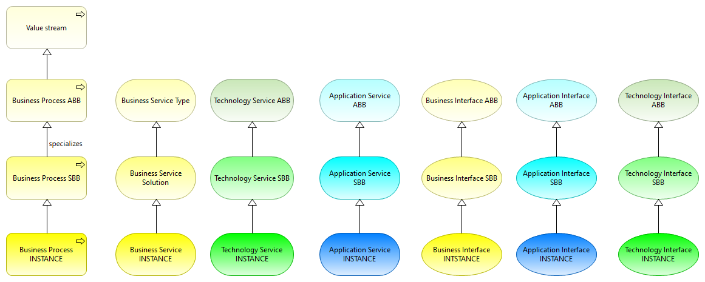
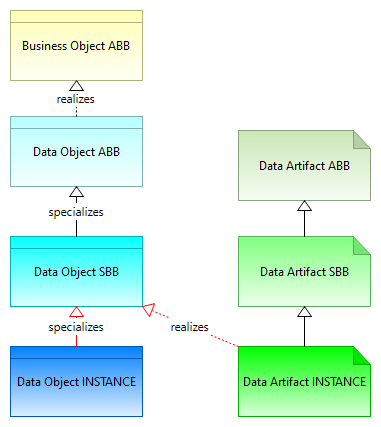
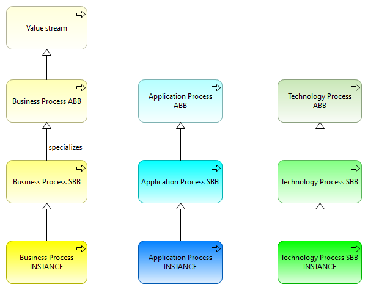
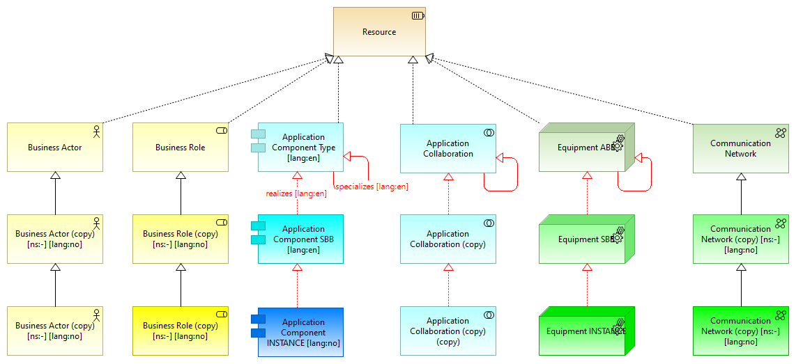
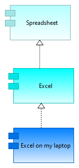
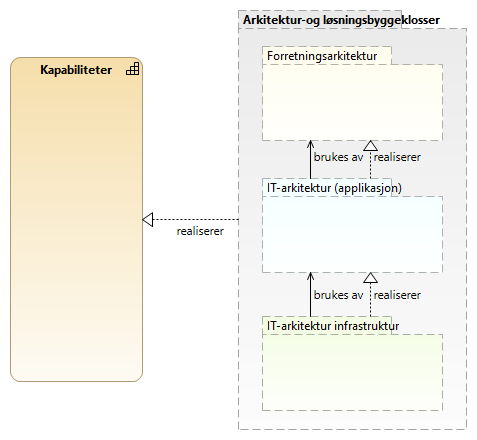
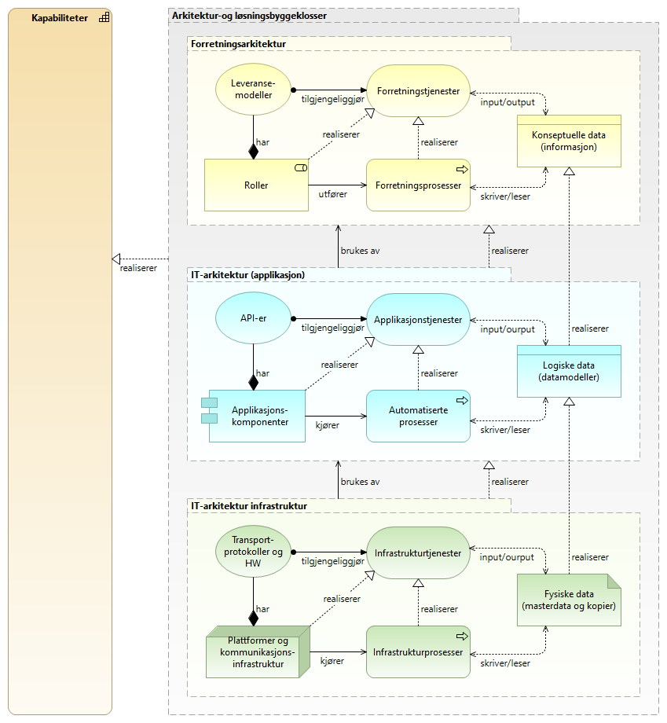
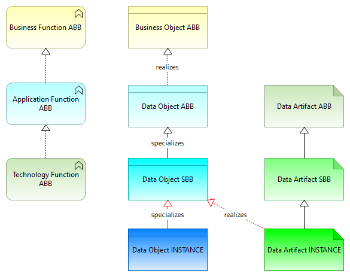

:lang: no
:doctitle: Modelleringskonvensjoner
:keywords: Modelleringskonvensjoner

:toclevels: 4

include::../plattform_felles/includes/commonincludes.adoc[]

image:../plattform_felles/media/i-arbeid.png[width=45, height=45, alt="Figur: i-arbeid.png?",]Uferdig innhold - første versjon er fremdeles i arbeid

== Generelt

Disse modelleringskonvensjonene  inngår i et overordnet sett av dokumentasjonskonvensjoner, der også konvensjonell tekstlig dokumentasjon inngår.

Begrepsapparat, konsepter og metamodeller for modelleringskonvensjonene bygger i hovedsak på link:https://pubs.opengroup.org/architecture/archimate3-doc/[modelleringsstandarden ArchiMate®] fra The Open Group. 
Med dette som utgangspunkt, gjøres visse presiseringer og utvidelser. Dette er nødvendig, fordi Archimate som standard er ment å være generell nok til å dekke ulike formål, samtidig som det savnes støtte for visse konsepter og detaljer. 

I tillegg til ArchiMate®, benyttes utvalgte konsepter fra link:https://www.omg.org/bpmn/[BPMN™], link:https://www.omg.org/dmn/[DMN™] og link:https://www.uml.org/what-is-uml.htm[UML®].

Andre modelleringsstandarder og metamodeller vurderes løpende, i sammenheng med utviklingen av nevnte standarder.  

== Modelleringsprinsipper
Foreløpig liste over temaer:

* Kombinasjon av modelleringsspråk
* Støtte for arkitekturparadigmer som tjenesteorientert arkitektur (SOA), hendelsedrevet arkitektur (EDA) og ressursorientert arkitektur (ROA)
* Ulike viewpoints for ulike målgrupper
* Enhetlig tilnærming på tvers av modelleringsspråk 
* Skille mellom abstraksjonnivåer
* Visuelle modeller vs. attributter og tekst

== Grunnleggende begrepsapparat og konsepter

=== Generelle begreper relatert til modeller 

* *Modell* 
+
TBD.

*Konsept*
+
TBD.

* *Element*
+
TBD.

* *Relasjon*
+
TBD.

* *Visningsmal (Viewpoint)*
+
TBD.

* *Visning (Wiew)*
+
TBD.

=== Konsepter

==== Kapabilitet vs. funksjon vs. prosess
TBD.

=== Aktør vs. rolle
TBD.

==== Ressurs vs. andre konsepter 
Ressursbegrepet omfatter

* Mennesker
* IT-systemer
* Applikasjoner
* Infrastruktur
* Teknologier
* Fysiske objekter
* Roller

==== Verdistrøm vs. prosess
Konseptet _Verdistrøm_  forstås her slik det beskrives i  link:https://en.wikipedia.org/w/index.php?title=Value_stream&oldid=912726011[Wikipedia-artikkel per august 2019 om _Value Stream_]

Legg spesielt merke til:

* _Value streams are not processes in the sense that the concern is "how value is achieved" rather than "how it's done"._
* _Value streams are not associated with the Lean concept of value stream mapping. While named similarly, Lean value stream mapping is a process-based practice that seeks to identify waste, whereas value streams provide a higher-level overview of how a stakeholder receives value._

NOTE: _Value stream_ som konsept ble først introdusert i link:https://pubs.opengroup.org/architecture/archimate3-doc/chap07.html#_Toc10045360[Archimate versjon 3.1], og er også forklart der.

   

==== Informasjon vs. data, representasjon og dokumenter

Strukturert informasjon vs. ustrukturert informasjon
Data vs. dokument
Datasett vs. Informasonselement

== Modelleringsprinsipper

=== Verktøystøtte

Prinsipp: Bruk modelleringsverktøy som gjør det mulig å  utveksle modeller på standardiserte utvekslingsformater med støtte for _essensielle_ modelleringskonvensjoner og attributter som angitt i Nasjonalt arkitekturbibliotek (her).

Essensielle modelleringskonvensjoner: 

TBD.

////

* Standardbasert utveksling av modeller
* Mulighet tli å spesifisere attributter
* Skripting eller tilsvarende for automatisering av oppgaver, konsistenssjekk og ensartet visning av modellelementer. 
////

//* Fjerning av ubrukte elementer (kan eventuelt gjøres med skripting)
//* Sammeslåing av objekter med identiske navn (kan eventuelt gjøres med skripting)
//* Referanseintegritet  

=== Kombinasjon av modelleringsspråk
Temaer som kommer her:

* Overgang fra identifiserte prosessmodeller i Archimate til mer detaljerte prosessmodeller i BPMN
* Overgang fra BPMN Service Tasks til modellering av Application Services og realisering i Archimate.
* Regelmodellering i DMN i sammenheng med BPMN for å unngå kompliserte og uoversiktlige prosessmodeller.

=== Støtte for arkitekturparadigmer som tjenesteorientert arkitektur (SOA), hendelsedrevet arkitektur (EDA) og ressursorientert arkitektur (ROA)

TBD.

=== Ulike viewpoints for ulike målgrupper

=== Enhetlig tilnærming på tvers av modelleringsspråk 

=== Visuelle modeller vs. attributter og tekst

=== Skille mellom abstraksjonnivåer

== Navnekonvensjoner (norsk)
=== Generelt
Som hovedregel følges navnkonvensjonene som er gitt i Archimate-standarden. Her gis unntak, presiseringer  og utdyping.

=== Navning av _kapabiliteter_

WARNING: Norsk navnekonvensjon for kapabiliteter er et  kontroversielt tema. Konvensjonene her kan bli gjenstand for endring.

* [underline]#*Hovedregel:*# Bruk ord som passer inn i setningsmalen: "Rolle/aktør/system må evne å <kapabilitetsnavn>." Dette vil normalt være _verb i infinitiv form_. 
+
Eksempel: En datakonsument må evne å _Innhente data_.

* [underline]#*Unntak:*#
Om det dreier seg om innarbeidede ord som kommuniserer bedre, kan det benyttes ord som passer inn i følgende alternative setningsmal: "Rolle/aktør/system må evne å gjøre <kapabilitetsnavn>". Dette vil normalt være _Verbalsubstantiv_.
+
Eksempel: "En virksomhet må evne å gjøre _Informasjonsforvaltning_". 

TIP: På engelsk fungerer det bedre   med _Verbalsubstantiv_ enn på norsk. En kan f.eks. godt si _Data reception_, mens ordet _Datamottaking_ ikke finnes på norsk; en må derfor ty til omskrivinger som _Mottak av data_ (eller bare _Datamottak_). Et annet ord som volder mye hodebry, er det engelske ordet _management_, som må oversettes til ord som _ledelse_, _styring_ eller _forvaltning_, ut fra hva som er innarbeidet i norsk språk og sett fra ulike faglige kontekster.

//WARNING: _Bestandig angi rolle(aktør/system som innehar, eller bør inneha, aktuell kapabilitet. En kapabilitet i "løse luften" er meningsløs._ 

=== Navning av _prosesser_ 
Hovedregel: Bruk verb i imperativ form.

Eksempel: _Innhent data_.

== Attributter
Her gis en informasjonsmodell med spesifikasjon av attributter og gyldige verdier for ulike konsepter i Archimate, uavhengig av verktøyvalg. 

NOTE: Navning og beskrivelser av attributter finnes kun på engelsk. Det antas at aktuelle målgrupper ikke ser noe problem i dette.  

TIP: Attributtverdier uten angivelse av navneområde (f.eks. prefiks _difi:_) antas å være støttet av "alle" aktuelle vertøy. Vurder å innføre navneområde for alle attributter her, for deretter å mappe mot standardattributter i verktøyspesifikke maler?   

==== Allmenne attributter (alle konsepter)
name:: Meaning: Short name, preferably fitting into a typically sized visual element in a diagram; i.e max 30-40 characters. Unless a Label is specified, this will be the name shown for concepts in views/diagrams.
+
Applicability: Models,Folders, Views, Concepts
+
Obligation: Mandatory.

dct:identifier:: Meaning: An unambiguous reference to the resource within a given context. Convention here: _Namespace:Name_.
+
Obligation: Mandatory.
+
Tool support: Should be automatically generated by the tool (e.g. by running a script). 

GUID:: Meaning: Globally Unique Identifier.
+
Obligation: Mandatory.
+
Tool support: Must be automtically generated.

label:: Meaning: May be used in order to specify how a _Name_attribute is shown, e.g to insert line breaks or add information about the type of concept. 
+
Applicability: Concepts

difi:source:: Meaning: Name of person or organization
+
* Applicability: Models; views; folders.

difi:author:: Meaning: Name of person or organization; with email address.
+
* Applicability: Models; views; folders.
+
* Type: String.
+
Valid values: Any.

difi:namespace:: Meaning: May be used in order to allow equally named concepts of the same type.
+
* Applicability: Models; views; folders.
+
* Valid values: Any text.

difi:name_no:: Meaning: Norwegian name (language code _no_). Note that difi:language_dialect may be used to further specify either language code _nb_ or _nn_, however there is no support for maintaining both _nb_ and _nn_ as alternative languages.  

difi:name_en:: Meaning: English name (language code _en_).

difi:orig_name:: Meaning: Original name, as coming from the difi:source in question. Typical usage: When basing a reference architecture on a more generic reference architecture, it is useful to be able to modify names while still keeping track of the original names. The original name may be included in reports. I will also be possible to completely revert to the orginal name.
+ 
* Applicability: All concepts.
+ 
* Valid values: Any text.

difi:language:: Meaning: The language to be displayed. If the value is not set, the default language of the entire model is to be assumed. 
+ 
* Applicability: All concepts.
+ 
* Valid values: en, no, nb, nn

difi:language_dialect:: Meaning: Further specification of language as set by the difi:language attriture according to link:https://no.wikipedia.org/wiki/ISO_639-1[ISO 639-1]. Example: Use either _nb_ (norsk bokmål) or _nn_ (norsk nynorsk) to specify the language dialect of the _no_ (norsk) language.

difi:default-language:: Meaning: TBD.
+ 
* Applicability: Model (all views and concepts)
+ 
* Valid values: en, no, nb, nn

difi:current-language:: Meaning: TBD.
+ 
* Applicability: Model (all views and concepts)
+ 
* Valid values: en, no, nb, nn

difi:orig-language:: Meaning: TBD.
+ 
* Applicability: All concepts.
+ 
* Valid values: en, no, nb, nn

difi:doc-lifecycle:: Meaning: Current status of the documentation as such for a view or a concept. Also see difi:abb-lifecycle and difi:sbb-lifecycle.
+
* Applicability: Views and concepts.
* Valid values: Initial; Preliminary; In work; Ready for review; Established; To be revised; Archived; To be deleted  

difi:notes:: Meaning: Views, concepts anf folders.
+
* Applicability: TBD.
* Mandatory: No.
* Valid values: TBD.

difi:metaLevel:: Meaning: TBD.
+
* Applicability: Views and concepts.
* Mandatory: No.
* Valid values: meta, real, undefined.

difi:abstractionLevel:: Meaning: TBD.
+
* Applicability: Views and concepts.
* Mandatory: No.
* Valid values: abb, sbb, instance.

difi:parentConcept:: Meaning: TBD.
+
* Applicability: TBD.
* Mandatory: No.
* Valid values: TBD.

difi:docRootPath:: Meaning: TBD.
+
* Applicability: TBD.
* Mandatory: No.
* Valid values: TBD.

difi:docViewPath:: Meaning: TBD.
+
* Applicability: TBD.
* Mandatory: No.
* Valid values: TBD.

////
difi:dct:BibliographicResource:: Meaning: TBD.
+
* Applicability: TBD.
* Mandatory: No.
* Valid values: TBD.
////

difi:notes:: Meaning: TBD.
+
* Applicability: TBD.
* Mandatory: No.
* Valid values: TBD.

difi:notes:: Meaning: TBD.
+
* Applicability: TBD.
* Mandatory: No.
* Valid values: TBD.

difi:notes:: Meaning: TBD.
+
* Applicability: TBD.
* Mandatory: No.
* Valid values: TBD.

difi:notes:: Meaning: TBD.
+
* Applicability: TBD.
* Mandatory: No.
* Valid values: TBD.

=== ABB-attributter

difi:abb-lifecycle:: Meaning: Current status of an ABB.
+
* Applicability: Concepts counting as Architectural Building Blocks.
+
* Valid values: Initial; Preliminary; In work; Ready for review; Established; To be revised; Archived; To be deleted

eira:reusability:: Meaning: General indication of the resusability of the solution.
+
* Applicability: Concepts counting as Solution Building Blocks.
* Valid values:  Excellent (90-100%); Very good (70-89,9%); Fair (50-74,9%); Poor (0-49,9%)

=== SBB-attributter (generelt)
difi:sbb-lifecycle:: Current lifecycle of solution.
+
* Valid values: Suggested; Planned; Under development; Operational; Deprecated 

=== SBB-attributter (Torget)

Målgruppe:: Meaning: TBD
+
* Valid values: Obligatorisk for statlige virksomheter; Anbefalt for statlige virksomheter; Anbefalt for kommunal sektor; Tilgjengelig for private virksomheter 
    
Sluttbrukere:: Meaning: TBD
+ 
* Applicability: Løsninger
+
* Valid values: Innbyggere; 
Ansatte i statlige virksomheter; 
Ansatte i kommunal sektor; Ansatte i private virksomheter; Maskiner/Systemer 

Innhold:: Meaning: TBD
+
* Applicability: Datakilder

Juridiske forutsetninger for bruk:: Meaning: TBD

Planlagte endringer::Meaning: TBD

Betaling:: Meaning: TBD

Forvalter:: Meaning: TBD

Lenke juridisk
Planlagte endringer
Lenke utviklingsplaner
Betaling
Lenke betaling
Forvalter
Sitatet
Lenke les mer
Lenke kom i gang
Brukes sammen med
Url på Torget (prod)

=== Konseptspesifikke attributter
TBD.

TIP: Inntil videre brukes attributt difi:Description med tekst i Asciidoc og tagging med meta. Maler for dette er under arbeid.  

== Archimate utvidelser

=== Spesialiserte konsepter
==== EIRA Cartograhy
TBD.

==== Risikomodellering
TBD.

==== Spesialisering av association-relasjoner
TBD.

=== Spesialiserte symboler
TBD.

== Konvensjoner for abstraksjon i Archimate 
Archimate-standarden gir rom for flere tolkninger og ulik praksis når det gjelder "abstraksjon".

Attributten difi:abstractionLevel benyttes for å angi om et konsept er å oppfatte som ABB (konseptuelt), SBB (logisk) eller INSTANS (fysisk).

Fargenyanser angir aktuelt abstraksjonsnivå, med lysest farge for ABB og mørkere nyanser for SBB og INSTANS.

Dette er angitt for de ulike konsepttypene i Archimate.

.Abstraksjon - ABB, SBB, INSTANCE

.Abstraksjon - data

.Abstraksjon - prosess

.Abstraksjon - ressurser

.Abstraksjon eksempler

== Konvensjoner for realisering i Archimate

=== Realisering av kapabiliteter 
Følgende figurer angir de viktigste konseptene.

.Realisering av kapabiliteter i arkitekturlagene - overordnet bilde

.Realisering av kapabiliteter i arkitekturlagene

=== Realisering av forretningstjenester
TBD

=== Annet om bruk av realisering i Archimate
.Realisering

== Modellering av tjenester i Archimate
Her kommer informasjon om modellering av SOAP, REST, micro services.

== Modellering av helt  eller delvis automatiserte prosesser i Archimate

== Kombinasjon av modelleringsspråk for prosessmodellering

Archimate: Verdikjeder, identifisering av prosesser. Automatisering av prosesser i IT-systemer (applikasjoner og infrastruktur). 

BPMN: Detajerte prosessmodeller; i sammenheneg med DMN for regelmodellering.

DMN: Regelmodellering; i sammenheng med BPMN for prosessmodellering.

UML: Klassediagrammer for informasjon og data

== Layout
Enhetlig layout av symboler og diagrammer 

.Diagram-layout
[width="100%",options="header"]
|====================
| Tema | Konvensjon 
| Symbolstørrelse | Bruk som hovedregel samme størrelse på symboler for å å få et "ryddig" inntrykk. Dette kan fravikes når det er hensiktsmessig, f.eks. for å framheve et symbol som står i fokus eller har mange relasjoner.  
| Alignment av symboler | Hovedregel: Midtstill symboler vannrett og loddrett. 
| Alignment av tekst i symboler | Hovedregel: Midtstill tekst i symboler vannrett og loddrett.  
| Nesting | Unngå "nesting" av symboler for der relasjonstypen er av betydning for forståelsen
| Visning av relasjonsnavn | Vis relasjonsnavn der det kan hjelpe leseren til å forstå diagrammet 
| Visning av symbolnavn | Angi eventuell tilleggsinformasjon i braketter [attributt:attributtverdi]. Eksempel: Angi namespace dersom flere konsepter med samme navn finnes: __Navn [ns:namsespaceverdi]__
| Fargenyanser for abstraksjonsnivå | Bruk fargenyanser for å angi aktuelt abstraksjonsnivå, med lysest farge for ABB og mørkere nyanser for SBB og INSTANS. Merk: Dette  kan gjøres ved å sette opp aktuelt modelleringsverktøy til å sette farge ut fra attributt for abstraksjonsnivå; dvs. difi:abstractionLevel (abb, sbb, instance).
|====================

