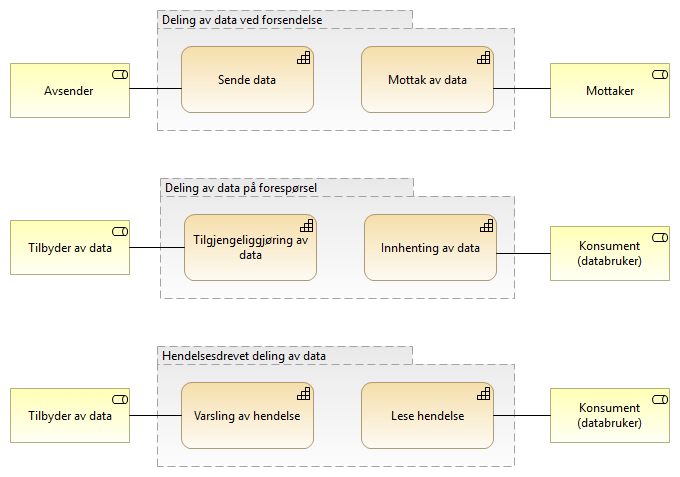

:lang: no
:doctitle: Begrepsapparat i tilknytning til valg av referansearkitekturer for datautveksling 
:keywords: Norsk, arkitekturbibliotek, offenlig sektor, virksomhetsarkitektur, NIF, samhandlingsarkitektur, rammeverk, GitHub

include::../plattform_felles/includes/commonincludes.adoc[]

:leveloffset: +1
= Kapabiliteter

.Figur: Primære kapabiliteter for datautveksling

For mer om kapabiliter og kapabilitersområder; se link:../nab_referanse_modeller_kapabiliteter/[her].

= Kvalitetsegenskaper
//Følgende figur viser en oversikt over kvalitetsegenskaper som det kan være aktuelt å vurdere ved evaluering av alternative referansearkitekturer for datautveksling.

.Figur: Kvalitetsegenskaper for datautveksling (utvalg)

image:../nab_referanse_arkitekturer/media/kvalitetsegenskaper-for-valg-av-referansearkitektur-datautveksling.png[]

= Samhandlingsmønstre
include::../nab_referanse_modeller_samhandlingsmønstre/main.adoc[]
:leveloffset: -1