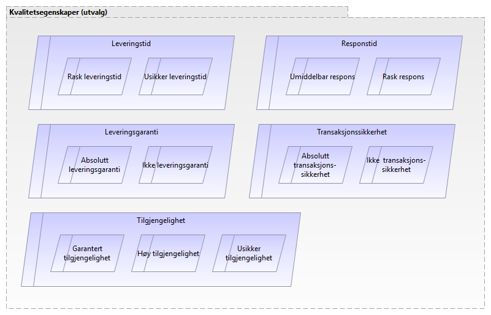

:lang: no
:doctitle: Begrepsapparat i tilknytning til valg av referansearkitekturer for datautveksling 
:keywords: Norsk, arkitekturbibliotek, offenlig sektor, virksomhetsarkitektur, NIF, samhandlingsarkitektur, rammeverk, GitHub

include::../plattform_felles/includes/commonincludes.adoc[]

:leveloffset: +1
= Kapabiliteter

.Figur: Primære kapabiliteter for datautveksling
image:../nab_referanse_modeller_kapabiliteter/media/kapabiliteter-datautveksling-overordnet.png[]

For mer om kapabiliter og kapabilitersområder; se link:../nab_referanse_modeller_kapabiliteter/[her].

= Kvalitetsegenskaper
//Følgende figur viser en oversikt over kvalitetsegenskaper som det kan være aktuelt å vurdere ved evaluering av alternative referansearkitekturer for datautveksling.

Vi tar et prosessutgangspunkt, hva er det forretningsmessige behovet?
 
EIF

Governance
Juridisk

* Dataminimering
	
Organisatorisk

* Forretningsprosess
	
Semantisk

* «Snakker vi om det samme?»
* Begreper
* Datamodeller
	
Teknisk

* Synkront/asynkront

Egenskaper og krav knyttet til forretningsprosess
 
* Responstid
* Tilgjengelighet/oppetid
* Leveringstid (hvor lang tid det tar)
* Leveringssikkerhet (garanti)
* Antall samhandlingsparter
* Dynamisk gruppe med samhandlingsparter

* (Overføring av «stafettpinne»)
* (Registeroppslag)
 
Egenskaper og krav knyttet til informasjonssikkerhet

* Konfidensialitetsbehov
* Integritet på overføring
* Tilgjengelighet
* Langtidsvalidering av integritet og autentisitet
* Ikke benekt
* Autentisering av samhandlingsparter
 
 
Andre vurderingskriterier

* Styring/governance
* Teknologivalg
* Avtaleforhold
* Pris
* Kompleksitet
* Eksisterende infrastruktur
* Bransjestandarder
* «Føring»

.Figur: Kvalitetsegenskaper for datautveksling (utvalg)

= Samhandlingsmønstre 
include::../nab_referanse_modeller_samhandlingsmønstre/main.adoc[]

= 

:leveloffset: -1

