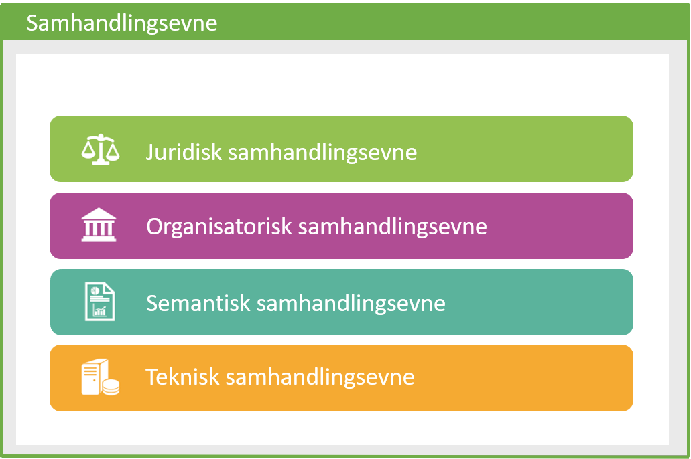
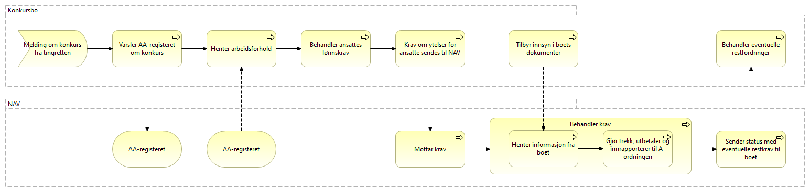
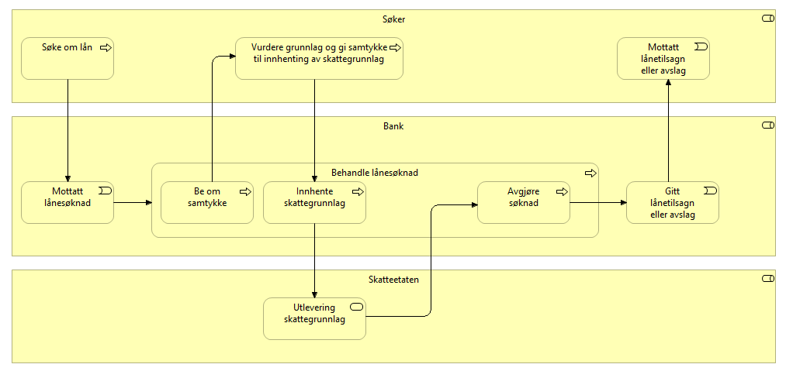
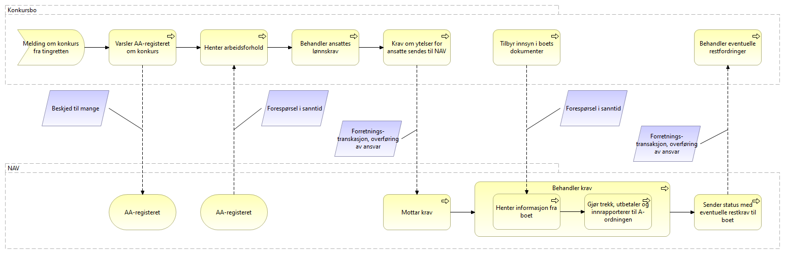
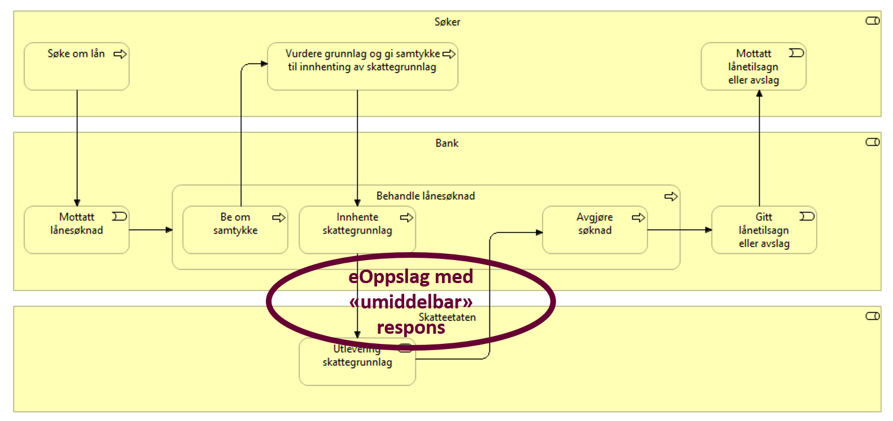
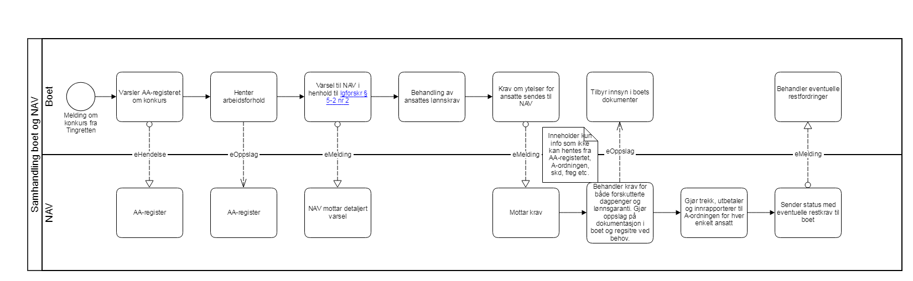
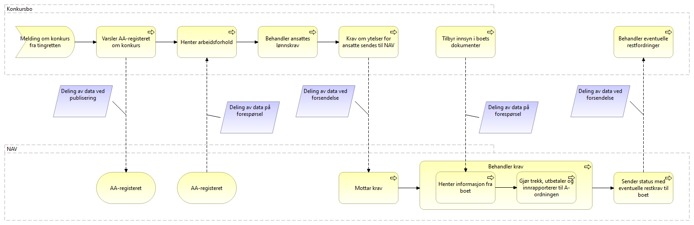
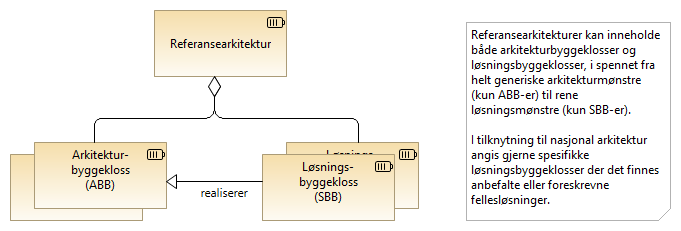
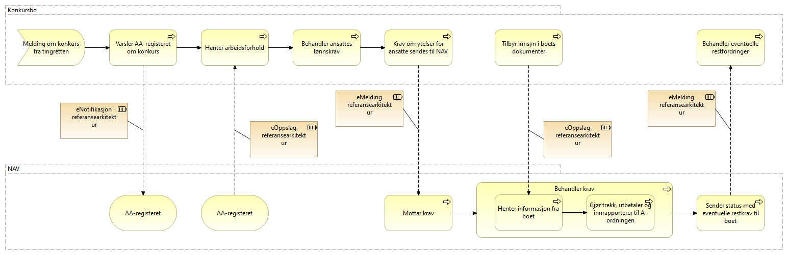

:lang: no
:doctitle: Metode for valg av referansearkitekturer i tverrgående samhandlingsløsninger
:keywords: Norsk, arkitekturbibliotek, offenlig sektor, virksomhetsarkitektur, NIF, samhandlingsarkitektur, rammeverk, GitHub

include::../plattform_felles/includes/commonincludes.adoc[]

//image:../plattform_felles/media/i-arbeid.png[width=45, height=45]

== Innledning

Metoden som beskrives her tar utgangspunkt i de fire interoperabilitetsnivåene i EIF for å oppnå ønsket samhandlingsevne på tvers av virksomheter:

 
Metoden sier noe om hvordan man skal oppnå digital samhandlingsevne og vil underveis peke på de fire interoperabilitetsnivåene. Det understrekes at man må jobbe i parallell med alle nivåene, da det er synergier mellom dem.

Metoden har som formål å sikre at man ikke snakker om teknisk samhandlingsevne før man forstår det forretningsmessige behovet på en tilfredsstillende måte. Erfaringene tilsier at man lettere kommer fram til et forslag til den digitale samhandlingsprosessen når man ikke snakker om teknologi. Når man har enighet om prosessen så kan man avklare hvordan den tekniske samhandlingsevnen skal ivaretas.

Metoden er først og fremst tenkt å bidra til hvordan to virksomheter kan digitalisere sin samhandling, men tankegodset kan også ha en verdi når man ser på hvordan to domener i en virksomhet skal samhandle digitalt.

Metoden er uavhengig av om den ene, begge eller ingen benytter serviceprovidere i deres løsninger.

Metoden er delt inn i fem steg:

. *Modeller fulldigitaliserte forretningsprosesser med fokus på samhandling*
. *Identifisere krav og egenskaper ved samhandlingen*
. *Identifiser referansearkitektur med fokus på samhandling*
. *Identifiser løsningsarkitektur*
. *Realiseringshensyn*

//Digital samhandling mellom virksomheter vil fra et forretningsperspektiv gjøres på et fåtall måter. Dette kaller vi samhandlingsmønstre og er beskrevet under.

I steg 1 vil vi modellere en digital samhandlingsprosess og i steg 2 vil vi beskrive hvilke forretningsmessige krav som stilles og hvilke egenskaper det er behov at samhandlingsmønsteret har for å kunne realisere samhandlingsprosessen. I steg 3 vil vi vurdere hvilke referansearkitekturer som bør benyttes for den digitale samhandlingsprosessen. Først når man har identifisert samhandlingsmønstre og referansearkitektur, er det riktig å diskutere løsningsarkitektur og hvilke tekniske løsningsalternativer man har for hver enkelt samhandling. Dette ser vi på i steg 4. I steg 5 vurderer vi øvrige realiseringshensyn som tilleggskomponenter og tjenester. Det må også gjennomføres en risikoanalyse av løsningen og fattes nødvendige tiltak. 

Sagt på en annen måte, man må forstå og være enige om behovet før man kan diskutere teknologi.

== Stegene i metoden
=== Steg 1 - Modeller fulldigitaliserte forretningsprosesser med fokus på samhandling

Basert på god forståelse av prosessene for fulldigitalisert samhandling mellom virksomheter og virksomhetenes rolle og ansvar i disse prosessen har man mulighet for å gjøre gode tekniske løsningsvalg for digital samhandling. Her beskrives hvordan man kan ta fram slike prosesser som først og fremst har fokus på den digitale samhandlingen på tvers av virksomheter.

////
Digital samhandling mellom virksomheter vil fra et forretningsperspektiv gjøres på et fåtall måter. Dette kaller vi link:../nab_referanse_arkitekturer/samhandlingsmønstre.adoc[samhandlingsmønstre]. I link:./metode_Steg2.adoc[steg 2] vil vi se på hvordan vi enkelt kan avdekke hvilke samhandlingsmønstre man har behov for å realisere en digital samhandlingsprosess og deretter mappe disse mor referansearkitekturer i link:./Steg3.adoc[steg 3]. Først når man har identifisert samhandlingsmønstre og referansearkitektur, er det riktig å diskutere løsningsarkitektur og hvilke tekniske løsningsalternativer man har for hver enkelt samhandling. Dette ser vi på i link:./Steg4.adoc[steg 4]. Sagt på en annen måte, man må forstå og være enige om behovet før man kan diskutere teknologi.
////

Ved modellering av forretningsprosessene kan det være lurt å la seg inspirere av digital agenda:

* "Brukeren i sentrum"
** "Offentlige tjenester skal oppleves sammenhengende og helhetlige for brukerne, uavhengig av hvilke offentlige virksomheter som tilbyr dem."
** "Forvaltningen skal gjenbruke informasjon i stedet for å spørre brukerne på nytt om forhold de allerede har opplyst om."
* "Effektiv digitalisering av offentlig sektor"
* "Godt personvern og god informasjonssikkerhet"
** "Personvern og informasjonssikkerhet skal være en integrert del av utviklingen og bruken av IKT."
** "Den enkelte innbygger skal i størst mulig grad ha råderett over egne personopplysninger."

Man bør også utforde hvordan digital samhandling er realisert inntil nå, og avklare hvor langt man kan gå i å gjennomføre en digital transformasjon. Husk å sette brukeren i fokus og at virksomhetens egne behov ikke overskygger det å gi gode løsninger til brukeren.

Ved modellering av forretningsprosesser på tvers av virksomheter, skal man tydelig avklare både eierskap til informasjon og funksjonalitet. Man skal deretter (eller i parallell) tenke på hvordan en fulldigitalisert prosess grovt sett ser ut hos hver enkelt part. Før man til slutt (eller i parallell) ser på hvordan samhandlingen burde fungert dersom begge parter blir fulldigitalisert på området man jobber med. Man bør prøve å forstå hvilke behov som styrer en hver samhandling, for eksempel:

//Henrik kommentar: Dette er viktige punkter med tanke på Klaus' kommentar til de opprinnelige 3 refereansearkitekturene

* Hente data der og da
* Varsle om en tilstandsendring (noe har skjedd)
* Overlevere ansvaret for videre behandling til annen part
* Oppdatere noe hos annen part
* Etc.

//Henrik kommentar: Avsnittet under, skal vi peke til "kompetansesenteret" når det gjelder juridisk? Og til noe mer overordnet enn begrepskatalogen når det gjelder semantisk?
Det er avgjørende at behandlingsgrunnlag (hjemler, samtykke etc.) for deling av informasjon er på plass slik at prosessen kan digitaliseres. Dersom det er behov for endringer i lovverk (juridisk samhandlingsevne), så må dette initieres mot rett lovgivende departement. Dersom det dukker opp nye sentrale begreper, så bør disse løftes inn i begrepskatalogen (semantisk samhandlingsevne). Gjennom å jobbe med digital prosess for samhandling tidlig, så vil man kunne avdekke behov knyttet til samhandlingsevne på de forskjellige interoperabilitetsnivåene.

Forretningsprosessens hovedformål er å identifisere digitale samhandlinger på tvers av virksomheter og ikke vise detaljer på hva som foregår i den enkelte virksomhet. Dette for å ha fokus på den digitale samhandlingen. 

#Legge til figur - eksempel på prosess#

//// 
Et eksempler på hvordan man kan modellere digital samhandling er prosessen for samtykkebasert lånesøknad som for eksempel kan modelleres slik:

//Henrik kommentar:er det greit med et så konkret case (som det tekstlig forutsettes at man kjenner) eller skal vi generalisere?

////

////
Prosessen for konkurs og lønnsgaranti kan for eksempel modelleres slik:

image:../nab_referanse_veiledning_valg-av-referansearkitekturer/media/Basis prosess lønnsgaranti.png[alt="bad!", width=1100]
////

Når to parter blir enige om en fulldigitalisert prosess, så har man et godt startpunkt på videre arbeid. Begge parter må kanskje gjøre løft i forhold til digitalisering, noe som ikke alltid er fullt ut mulig. Som regel vil man kunne digitalisere samhandlingen for fremtiden og så kan hver og en virksomhet stegvis dra nytte av dette til å digitalisere interne løsninger. Unntaksvis må man kanskje fire på kravet på hvor langt man vil gå i å digitalisere samhandlingen. I steg 2 vil vi se på og identifisere krav og egenskaper til samhandlingen mellom aktørene i den digitale prosessen. Steg 2 kan med fordel kjøres samtidig som steg 1, men er av pedagogiske grunner dokumentert separat.

=== Steg 2 - Identifisere funksjonelle krav og egenskaper ved samhandlingen

#Steg 2  - presisere at det identifisering av funksjonelle krav og egenskaper.
Se om vi kan løfte inn fra kap.3 inn i trinnene til metoden.
Ikke de tekniske, men de forretningsmessige delene.#

Som del av modellering av en digital samhandlingsprosess i steg 1, så er det naturlig å identifisere hvilke behov og krav man har til samhandlingsmønstre og beskrive dette for hver enkelt identifiserte samhandling.

Dette gjøres best gjennom å forstå behovet for hver enkelt samhandling. Det er viktig at begge partene prater gjennom prosessen sammen, slik at man får en felles forståelse av krav og egenskaper. I dette arbeidet kan man bruke faktorene som er beskrevet i kapittel 2 og se til de ulike interoperabilitetslagene, og på denne måten bestemme hvilke egenskaper som er viktig for den respektive samhandlingen og integrasjonen mellom partene.

I eksempelet vårt med samtykkebasert lånesøknad vil det f.eks. være blant annet følgende faktorer:

* mange til en
* kjente samhandlingsparter
* forretningsmessig behov for synkron kommunikasjon
* behov for umiddelbar respons

////
I prosessen for samtykkebasert lånesøknad kan for eksempel da identifisere samhandlingsmønster slik:

image:../nab_referanse_veiledning_valg-av-referansearkitekturer/media/Prosess SBL med angivelse av mønster.png[alt="bad!", width=750]

I prosessen for konkurs og lønnsgaranti kan vi identifisere flere ulike samhandlingsmønster:

image:../nab_referanse_veiledning_valg-av-referansearkitekturer/media/Prosess med mønster lønnsgaranti.png[alt="bad!", width=1100]
////
Når dette er identifisert for hver enkelt samhandling, så blir neste steg å analysere behov og identifisere referansearkitektur.

=== Steg 3 - Identifiser referansearkitektur med fokus på samhandling

Når faktorene som spiller inn er identifisert i steg 2, så kan man mappe hver enkelt samhandling mot en  referansearkitektur.

Har man fått til en god enighet om faktorene, så vil ofte prosessen med å mappe mot referansearkitektur være ganske enkel. Det er vanskelig å sette opp absolutte regler for hva som egner seg i enhver situasjon, men kriteriene bør gi et godt utgangspunkt for en beslutning.

For eksempelet med lånebasert søknad vil referansearkitekturen for eOppslag være å anbefale.

////
Mapping til referansearkitektur for lånesøknad vil da se slik ut:

Mapping til referansearkitektur for  konkurs og lønnsgaranti vil da se slik ut:

////

Når referansearkitektur er identifisert for hver enkelt samhandling, så blir neste steg å identifisere løsningsarkitektur med tilhørende løsningskomponenter som beskrevet i steg 4.

=== Steg 4 - Identifiser løsningsarkitektur
Når referansearkitektur er identifisert, se steg 3, kan man gå videre å jobbe med løsningsarkitektur.

Fra et arkitekturståsted så består en referansearkitektur av et sett med funksjonelle byggeklosser (ABBer) som representerer funksjonaliteten som kreves for å realisere samhandlingsbehovet. Det vil både kunne være påbudte og valgfrie funksjonelle byggeklosser. Valgfrie byggeklosser benyttes kun der behov og krav til kvalitetsegenskaper tilsier at det kreves. For eksempel vil ikke alle samhandlingsbehov kreve kapabiliteten konfidensialitetssikring for eOppslag.

Hver av de funksjonelle byggeklossene kan realiseres av en eller flere løsningskomponenter (SBBer). En funksjonell byggekloss kan ha flere mulige løsningskomponenter. Rett løsningskomponent velges basert på behov og kvalitetsegenskapene som kreves, og som best svarer på behov og krav til kvalitetsegenskaper, inkludert behov avdekket som del av risikoanalyse for sikkerhet og personvern. Se følgende konseptuelle figur.

//image:../nab_referanse_veiledning_valg-av-referansearkitekturer/media/Mapping referansearkitektur til løsningsarkitektur.png[alt="missing figure", width=250]

.Figur: Referansearkitektur kan angi både arkitektur- og løsningsbyggeklosser

Man velger løsningsarkitektur ved å ta utgangspunkt i beste praksis for referansearkitekturen og se om denne dekker behovet. Der valget står mellom flere løsningskomponenter, må man vurdere hvilken som best dekker funksjonelle behov og krav til kvalitetsegenskaper. Har man spesielle behov, kan det hende man må ta i bruk løsningskomponenter som ikke ligger dokumentert som beste praksis. I så fall bør man oppdatere beste praksis.

=== Steg 5 - Andre realiseringshensyn
Vurdering av andre hensyn, alternativer. Valgfrie tjenester. Det må også vurderes om det trengs tilleggskomponenter/tjenester som f.eks. data.altinn.no for best å realisere løsningen. 
Gjennomføre risikoanalyse for valgt løsning og bestemme nødvendige sikkerhetsmekanismer.
"Verdiøkende tjenester" En boks i midten må gi verdi.

Kompetanse, kapasitet, risiko, datoer
