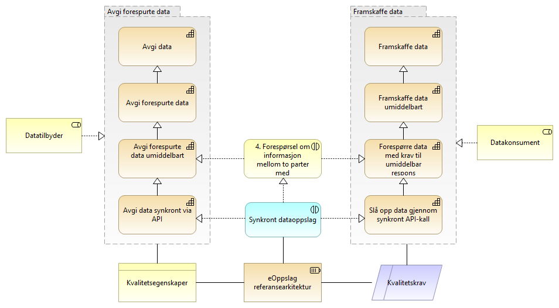

:lang: no
:doctitle: Vurdering av kvalitetsegenskaper
:keywords: Norsk, arkitekturbibliotek, offenlig sektor, virksomhetsarkitektur, NIF, samhandlingsarkitektur, rammeverk, GitHub

include::../plattform_felles/includes/commonincludes.adoc[]

== Generelt om denne metoden for valg av referansearkitekturer

image:../plattform_felles/media/i-arbeid.png[width=45, height=45] I arbeid

Referansearkitekturer velges ut fra  behov. Dette kan gjøres ved å betrakte kapabiliter og kvalitetsegenskaper. 

== Vurdering av kvalitetsegenskaper

.Figur: Vurdering av kvalitetsegenskaper for kapabiliteter
image:../nab_referanse_arkitekturer/media/valg-av-ra-for-datautveksling-basert-på-kapabilitetsområde-og-kvalitetskrav.png[]

== Beslutningstre
image:../plattform_felles/media/i-arbeid.png[width=45, height=45] I arbeid

.Figur: Følgnde figur utvikles tli et beslutningstre! Her er dete så langt bare et  eksempel so ser på kapabilitetsområdet __Deling på forespørsel__ og beslutning om synkront dataoppslag. 
//på sammeheng mellom kapabiliteter,  "samhandlingsmønstre" (business interaction og application interaction); her for 

== Sammenheng med  samhandlingsmønstre

image:../plattform_felles/media/i-arbeid.png[width=45, height=45] I arbeid

For kapabiliteer som krever samhandling med andre parter, benyttes konseptet  _business interaction_ (ref. modelleringsstandarden Archimate) for å knytte sammen samhandlende parter og kapabiliteter på forretninsgmessig nivå. Tilsvarende brukes _application interaction_ eller _technology interaction_ på teknisk nivå.

_Business interaction_ tilsvarer begrepet samhandlingsmønster, slik dette tidligere er brukt i tilknytning tli arbeid med referansearkitekturer.

