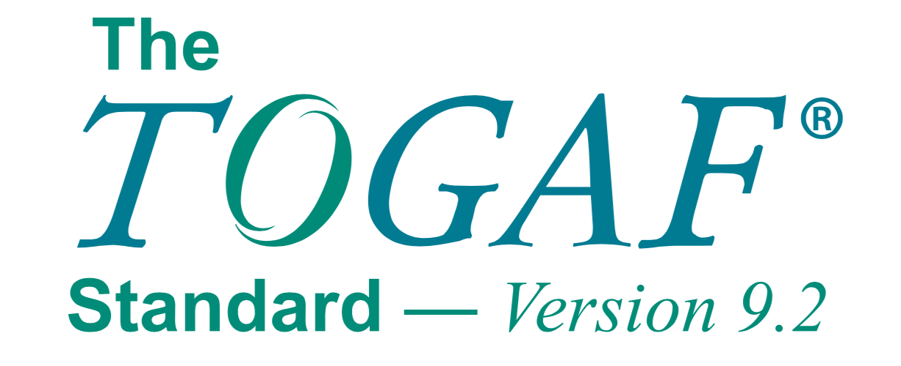
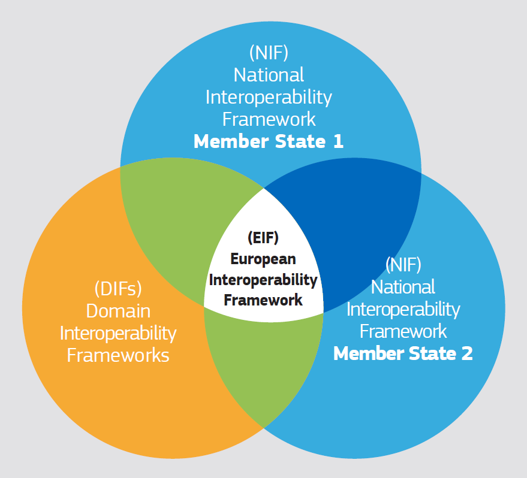
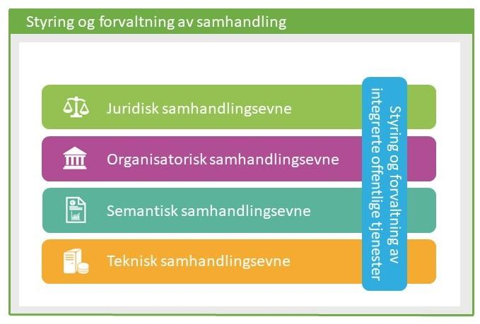
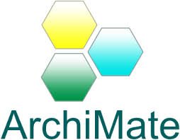
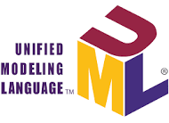
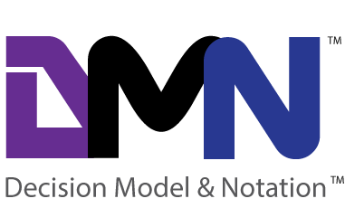

:lang: no
:doctitle: Standarder
:keywords: Standarder 

include::../plattform_felles/includes/commonincludes.adoc[]

[.lead]
Gjeldende standarder innen IKT og virksomhetsarkitektur i norsk offentlig sektor

== Generelt
Her gis oversikt og lenker til mer informasjon om gjeldende _IT-standarder_ i norsk offentlig sektor. 

Det skilles inntil videre mellom standarder innen arkitektur og standarder som inngår i Referansekatalogen for IT-standarder (historisk betinget).

Se også 

== Referansekatalogen for IT-standarder
Referansekatalogen for IT-standarder er en oversikt over IT-standarder som er obligatoriske eller anbefalte for offentlig sektor. Katalogen samler tverrsektorielle krav til bruk av IT-standarder på ett sted, og lenker også til sektorspesifikke oversikter, som e-Helses referansekatalog.

Aktuelle bruksområder (per mars 2019):

* Arkivstandarder
* Begrepsanalyse og definisjonsarbeid
* Beskrivelse av datasett og datakataloger
* Bruk av PKI med og i offentlig sektor
* Digitale anskaffelser
* E-bøker (store dokumenter)
* Grunnleggende datakommunikasjon
* Helse – referansekatalogen for e-helse
* Internkontroll/ styringssystem/ ledelsessystem for informasjonssikkerhet
* Nettleserbaserte tjenester
* Pekere til offentlige ressurser på nett
* Publisering av multimediainnhold på offentlige nettsider
* Publisering av tekstdokumenter
* Sikre kommunikasjonskanaler
* Skjema på offentlige nettsider
* Standardavtaler i offentlig sektor
* Tegnsett
* Universell utforming av ikt
* Utveksling av tekstdokumenter
* Videokonferanse

Se oppdatert informasjon under https://www.difi.no/referansekatalogen [Difis hjemmesider om Referansekatalogen for IT-standarder].

== Rammeverk
=== TOGAF

 
=== EIF - European Interoperability Framework 

=== Norsk rammeverk for samhandlingsarkitektur (National Interoperability Framework)

== Modelleringsstandarder

=== Archimate

=== BPMN

=== UML

=== DMN

