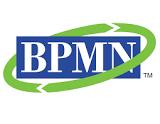

:lang: no
:doctitle: Standarder
:keywords: Standarder 

include::../plattform_felles/includes/commonincludes.adoc[]

[.lead]
Gjeldende standarder for felles arbeid med  virksomhetsarkitektur i norsk offentlig sektor

== Generelt
Her listes gjeldende standarder for felles arbeid med  virksomhetsarkitektur i norsk offentlig sektor.

== Rammeverk
=== TOGAF

 
=== EIF - European Interoperability Framework 
image:../nab_standard/media/eif-logo.png[width=300]

=== Norsk rammeverk for samhandlingsarkitektur (National Interoperability Framework)
image:../nab_standard/media/nif-logo.jpg[width=400]

== Modelleringsstandarder

=== Archimate
image:../nab_standard/media/archimate-logo.png[width=120]

=== BPMN

=== UML

=== DMN
image:../nab_standard/media/dmn-logo.png[width=120]
