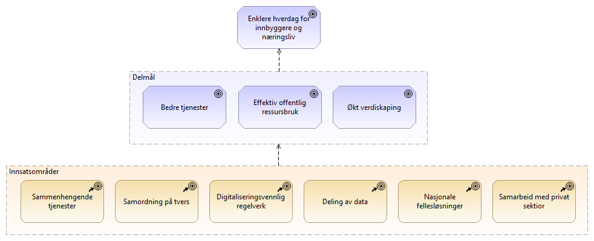

:lang: no
:doctitle: Strategiske føringer
:keywords: Norsk, arkitekturbibliotek, offenlig sektor, virksomhetsarkitektur, NIF, samhandlingsarkitektur, rammeverk, GitHub
:keywords_en: Norwegian, Architecture Repository, Public sector, Enterprise Architecture, NIF, Architecture Interoperability Framework, GitHub,
:toclevels: 4
include::../plattform_felles/includes/commonincludes.adoc[]

//[.lead]
//Strategiske føringer
image:../plattform_felles/media/i-arbeid.png[width=45, height=45] _I arbeid_

== Digital agenda
TBD.

== Regjeringens digitaliseringsstrategi 2019-2025 

.Mål og innsatsområder i regjeringens digitaliserngsstrategien 2019-2025

== Digitaliseringsrundskrivet
TBD.

== Tildelingsbrev (DIFI)
TBD.

== Andre overordnende føringer
image:../plattform_felles/media/i-arbeid.png[width=45, height=45] _Til vurdering_

== Norskje lover og regler
TBD

== EU-forordninger
TBD

