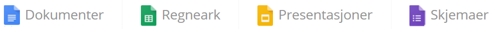

:lang: no
:doctitle: Om NAP-plattformen
:keywords: Github, asciidoc, archi, slack

include::../plattform_felles/includes/commonincludes.adoc[]

[.lead]
Nasjonalt Arkitekturverksted er en plattform for samproduksjon og deling av arkitekturdokumentasjon, tilrettelagt av Difi.

//image:../plattform_felles/media/i-arbeid.png[width=45, height=45] I arbeid

////
////

== Generelt 

Nasjonalt Arkitekturverksted, også kalt Nasjonal Arkitekturplattform  (NAP), gir verktøy og metoder for samproduksjon og deling av arkitekturdokumentasjon på tvers av sektorer og virksomheter.

NOTE: Nasjonalt Arkitekturverksted fungerer blant annet som produksjonsplattform for innhold i  *_Torget for digitale fellesløsninger_* (arbeidstittel; se også link:https://www.difi.no/blogg/2019/05/det-er-pa-torget-det-skjer[blogg om Torget, mai 2019].

Plattformen utgjøres i hovedsak av gratis verktøy og åpen kildekode. 

Her gis en oversikt over verktøyene i plattformen, samt hvordan disse inngår i aktuelle samarbeidsprosesser. Det gis også praktiske tips om hvordan komme i gang med de viktigste verktøyene for å bidra med innhold. 

== Praktiske tips for å komme i gang
:leveloffset: +1
include::../plattform_praktiske-tips/main.adoc[]
:leveloffset!:

== Mer om arbeidsformer og arbeidsflyt
TBD.

NOTE: Her kommer det mer om arbeidsprosesser i tilknutning  til plattformen.

== Mer om verktøy

=== Github 
image:../plattform_om-plattformen/media/github-logo.png[width=100, height=100] 

link:https://github.com/[Github] benyttes for lagring og versjonsstyring av tekstbasert innhold og multimediafiler.

=== Asciidoc og Asciidoctor
image:../plattform_om-plattformen/media/asciidoctor-logo.png[width=60, height=60] 

link:https://asciidoctor.org/docs/what-is-asciidoc/[Asciidoc] er primært kildeformat for tekstbasert dokumentasjon.

link:https://asciidoctor.org/[Asciidoctor] benyttes for publisering av innhold i Asciidoc.

=== Archi
image:../plattform_om-plattformen/media/archi-logo.png[width=180, height=180]

link:https://www.archimatetool.com/[Archi] benyttes som samarbeidsplattform for å ta fram  arkitekturmodeller basert på Archimate-standarden.

=== Slack
image:../plattform_om-plattformen/media/slack-logo.png[width=200, height=200]

link:https://slack.com/intl/en-no/[Slack] brukes som samarbeidsplattform og diskjonsforum for visse formål.

=== Zotero
link:https://www.zotero.org/[Zotero] er et referansehandteringsverktøy som hjelper med å samle og holde oversikt over referanser. Zotero samhandlar med Word, OpenOffice og LibreOffice, og kan enkelt nyttast med LaTeX.

TIP: Integrasjon med Asciidoctor finnes, men er foreløpig ikke testet. 

=== Google Drive, Google Docs og Google Sheets
image:../plattform_om-plattformen/media/googledrive-logo.png[width=100, height=100]

link:https://www.google.com/intl/no/drive/[Google Drive] og noen av Google applikasjoner (dokumenter og regneark) benyttes for lagring og samproduksjon av dokumenter, som alternativ til Asccidoc for visse formål og brukergrupper.

=== Microsoft Onedrive
image:../plattform_om-plattformen/media/onedrive-logo.png[width=100, height=100]

MS Onedrive benyttes også for lagring av dokumenter, som alternativ til Google Drive for visse formål og brukergrupper.

