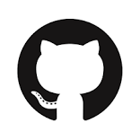

:lang: no
:doctitle: Om plattformen
:keywords: Github, asciidoc, archi, slack

include::../plattform_felles/includes/commonincludes.adoc[]

[.lead]
Plattform for samproduksjon og deling av arkitekturdokumentasjon, tilrettelagt av Difi.

image:../plattform_felles/media/i-arbeid.png[width=75, height=75] I arbeid

:numbered:

////
////

== Introduksjon 

Plattformen består av 

image:../plattform_om-plattformen/media/archi-logo.png[width=180, height=180]
image:../plattform_om-plattformen/media/slack-logo.png[width=200, height=200]
image:../plattform_om-plattformen/media/asciidoctor-logo.png[width=80, height=80]

////

