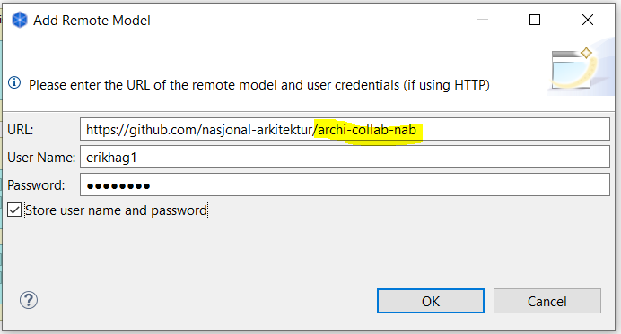
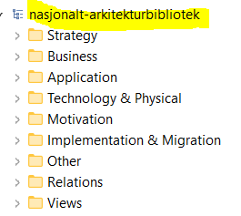

:lang: no
:doctitle: Praktiske tips om bruk av Archi
:keywords: Archi

include::../plattform_felles/includes/commonincludes.adoc[]

[.lead]
Archi er et gratis og open-source verktøy som støtter Archimate-standarden for arkitekturdokumentasjon, og har tillegg som muliggjør samarbeid rundt felles repository på Github.  

image:../plattform_praktiske-tips_archi/media/archi-logo.png[]
 
//image:../plattform_felles/media/i-arbeid.png[width=75, height=75] Uferdig innhold

////
////

== Generelt
Archi er gratis og i utbredt bruk både i Norge og internasjonalt. Det er derfor inntil videre valgt som samarbeidsplattform for arbeidet med Nasjonal arkitektur. 

Dette betyr ikke at andre verktøy ikke kan brukes. Archi mangler endel funksjonalitet som finnes i mange andre verktøy, så integrajoner på tvers av ulike verktøy er aktuelt.

== Archi repository på GitHub

Et felles Archi-repository for arbeidet med nasjonal arkitektur finnes på Github, her: https://github.com/nasjonal-arkitektur/archi-collab-nab.
Gi beskjed til nasjonalarkitektur@difi.no om du ønsker skriverettigheter til dette biblioteket.

NOTE: I tillegg til dette biblioteket, finnes andre modeller som du kanskjeogså er interessert i. Se  

== Installer og konfigurer Archi

1. *Last ned og installer Archi*
+
Last ned og installer siste versjon av Archi fra https://www.archimatetool.com/download/

2. *Konfigurer "diagram appearance"*
+
Det er generelt ønskelig at de fleste symboler har samme størrelse, Standard symbolstørrelse settes slik at det er plass til 4 linjer med "litt lange ord"; se figur nedenfor. Dette holder for de fleste formål. Det velges videre å bruke _gradienter_ i fargevisningen, fordi dette for mange oppleves som et mer "profesjonelt" uttrykk.
+
.Figur: Konvensjon for konfigurasjon av symbolstørrelser og fargegradient
image:../plattform_praktiske-tips_archi\media\preferences-appearance.png[]
+
.
  
3. *Konfigurer foretrukne Archi standardfigurer*
+
Det er sterkt ønskelig å standardisere på symbolbruken. Archimate-standarden gir valgmuligheter som kan forvirre. Foretrukne standardfigurer konfigureres under menyen Edit | Preferences | Diagram | Default Figures. Benytt da valg som vist i følgende figur.
+
.Figur: Konvensjon for konfigurasjon av _default figures_ i Archi

WARNING: Archi har per januar 2019 begrenset funksjonalitet for dette. En har f.eks, ikke noen alternativer for Actor. En kan heller ikke benytte egne symboler.

== Installer og konfigurer Collaboration plugin

1. *Skaff deg en GitHub-bruker*
+
Du trenger en brukerkonto på GitHub. Dersom du ikke allerede har en GitHub-bruker, kan du skaffe deg det https://github.com/join?source=header[her].
+
Se eventuelt også link:../plattform_praktiske-tips_github/[praktiske tips om bruk av GitHub] for annen informasjon om GitHub (ikke nødvendig her).

3. *Last ned og installer Collaboration Plugin*
+
Last ned og installer Model Repository Collaboration Plugin fra  https://www.archimatetool.com/plugins/. Collaboration-menyen skal da komme til syne, slik: 
+
image:../plattform_praktiske-tips_archi/media/collaboration-plugin.png[width=450, height=450]
+

4. *Konfigurer Collaboration Plugin*
+
Sett inn ditt git brukernavn (Name) og e-post (Email), og mappe-navnet (Local Repository Folder) der du ønsker at Archi skal legge filene når du importerer fra "Github-repoet". 
+
image:../plattform_praktiske-tips_archi/media/archi-collaboration-preferences.png[width=600, height=600]

== Importer Github-repository
Velg [underline]#Import Remote Model to Workspace# fra menyen under Collaboration i Archi, og oppgi https://github.com/nasjonal-arkitektur/archi-collab-nab
 som URL og oppgi ditt git brukernavn og passord.

Når du klikker OK, vil det bli opprettet en mappe ved navn  #_archi-collab-nab_# under den mappen du har satt opp under Preferences (se over).

Modell-vinduet i Archi vil vise #_nasjonalt-arkitekturbibliotek_# som modellnavn:

== Endring og synkronisering
De endringene du gjør blir ikke synlige for andre før du publiserer endringene dine. Det finnes flere valg i Collaboration-menyen for synkronisering. Tips:

* Bruk [underline]#Refresh# om du bare vil laste ned endringer som andre har gjort (git pull).
* [underline]#Publish# gjør både Refresh, Commit og Publish - alt i ett.

_NB: Om flere jobber på de samme modellene samtidig, kan det bli behov for litt kompliserte "merge-operasjoner". Om du opplever problemer med dette, er det fint om du melder fra via en _issue_ i GitHub (eller per e-post til nasjonalarkitektur@difi.no).

== Tips for å finne og gjenåpne en lukket Archi-modell lokalt
Collaboration-plugin oppretter en .git undermappe som ikke uten videre er synlig, der det blant annet ligger en #temp.archimate# fil. Det er denne filen som åpnes i Archi når du har importert biblioteket. Nyttig å vite dersom du f.eks. har kommet til å lukke modellen fra workspace i Archi før du har publisert endringene dine. Det er altså bare å åpne denne filen, så kommer den opp i Archi, helt tilsvarende "normale" Archi-filer og med samme innhold som klonet og eventuelt modifisert modell.    

image:../plattform_praktiske-tips_archi/media/hidden-git-files.png[width=300, height=300]

== Archi scripts fra Difi for støtte til administrasjon og modellering
Difi har utviklet noen scripts for å effektivisere modellering og administrasjon av arkitekturbibliotek. Disse scriptene er gjort i jArchi med bruk av Archi-s Scripting Plugin, og krever installasjon av Archi-s Scripting Plugin for å kunne kjøres.

Se link:../nab_løsningslandskap_sbb_archi-scripts/[praktiske Archi scripts] for mer informasjon om funksjonalitet og praktisk bruk av disse scriptene.

== Andre plugins til Archi
Se http://archi-contribs.github.io/
