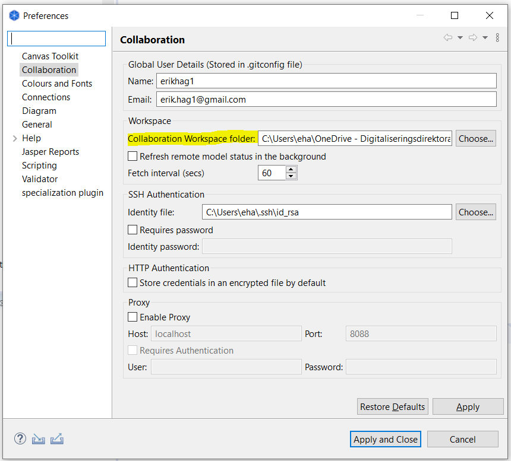

:lang: no
:doctitle: Praktiske tips om samarbeid med Archi
:keywords: Archi

include::../nab_felles/includes/commonincludes.adoc[]

[.lead]
Archi er et gratis og open-source verktøy som støtter Archimate-standarden for arkitekturdokumentasjon, og har tillegg som muliggjør samarbeid rundt felles repository på Github.  

image:../plattform_praktiske-tips_archi/media/archi-logo.png[]
 
//image:../nab_felles/media/i-arbeid.png[width=75, height=75] Uferdig innhold

////
////

== Generelt
Et felles Archi-repository for arbeidet med nasjonal arkitektur finnes på Github, her: https://github.com/nasjonal-arkitektur/archi-collab-nasjonal-arkitektur.

Du behøver ikke skriverettigheter til selve Github-biblioteket, siden du får det gjennom bruk av en "collaboration plugin" i Archi.

==  Installer Archi og plugin

1. *Last ned og installer Archi*
+
Last ned og installer siste versjon av Archi fra https://www.archimatetool.com/download/

2. *Skaff deg en GitHub-bruker*
+
Du trenger en brukerkonto på GitHub. Dersom du ikke allerede har en GitHub-bruker, kan du skaffe deg det https://github.com/join?source=header[her].

3. *Last ned og installer Collaboration Plugin*
+
Last ned og installer Model Repository Collaboration Plugin fra  https://www.archimatetool.com/plugins/. Collaboration-menyen skal da komme til syne, slik: 
+
image:../plattform_praktiske-tips_archi/media/collaboration-plugin.png[width=450, height=450]
+

4. *Konfigurer Collaboration Plugin*
+
Sett inn ditt git brukernavn (Name) og e-post (Email), og mappe-navnet (Local Repository Folder) der du ønsker at Archi skal legge filene når du importerer fra "Github-repoet". 
+

5. *Eventuell videre konfigurering*
+
Du kan konfigurere dine foretrukne standardfigurer under menyen Edit, Preferences, f.eks. slik:
+
image:../plattform_praktiske-tips_archi/media/preferences-default-figures.png[width=600, height=600]

WARNING: Archi har per januar 2019 begrenset funksjonalitet for dette. En har f.eks, ikke noen alternativer for Actor. En kan heller ikke benytte egne symboler.

== Importer Github-repository
Velg [underline]#Import Remote Model to Workspace# fra menyen under Collaboration i Archi, og oppgi https://github.com/nasjonal-arkitektur/archi-collab-nasjonal-arkitektur som URL og oppgi ditt git brukernavn og passord.

Når du klikker OK, vil det bli opprettet en mappe ved navn  _archi-collab-nasjonal-arkitektur_ under den mappen du har satt opp under Preferences (se over).

image:../plattform_praktiske-tips_archi/media/add-remote-model.png[width=550, height=550]

Modell-vinduet i Archi vil vise #difi-nasjonal-arkitektur# som modellnavn:

image:../plattform_praktiske-tips_archi/media/archi-workspace.png[width=220, height=220]

== Endring og synkronisering
De endringene du gjør blir ikke synlige for andre før du publiserer endringene dine. Det finnes flere valg i Collaboration-menyen for synkronisering. Tips:

* Bruk [underline]#Refresh# om du bare vil laste ned endringer som andre har gjort (git pull).
* [underline]#Publish# gjør både Refresh, Commit og Publish - alt i ett.

_NB: Om flere jobber på de samme modellene samtidig, kan det bli behov for å rydde opp i "merge-operasjoner". Jeg (erikhag1) har opplevd problemer med dette, men er usikker på hvordan det best håndteres. Tips meg om du vet?_

== Andre tips
* Collaboration-plugin oppretter en .git undermappe som ikke uten videre er synlig, der det blant annet ligger en #temp.archimate# fil. Det er denne filen som åpnes i Archi når du har importert biblioteket. Nyttig å vite dersom du f.eks. har kommet til å lukke modellen fra workspace i Archi før du har publisert endringene dine! Det er altså bare å åpne denne filen, så kommer den opp i Archi, helt tilsvarende "normale" Archi-filer.    
+ 
image:../plattform_praktiske-tips_archi/media/hidden-git-files.png[width=300, height=300]

