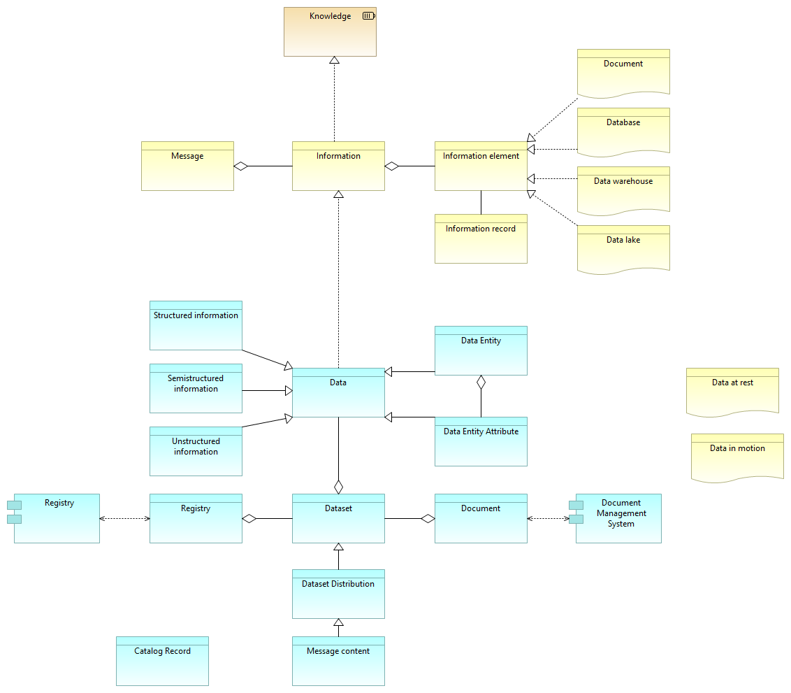

== Sentrale begreper - informasjon vs. data, dokumenter  og 

Data is raw, unorganized facts that need to be processed. Data can be something simple and seemingly random and useless until it is organized. When data is processed, organized, structured or presented in a given context so as to make it useful, it is called information.

The degree of data structure may vary, from unstructured to semistructured and highly structured.

Note: This section is under construction.

.Sentrale begreper - informasjon vs. data, dokumenter  og 

[cols ="1,1,3", options="header"]
.Elementer i view for Sentrale begreper - informasjon vs. data, dokumenter  og 
|===

| Data
| data-object
| 

| Dataset
| data-object
| A collection of data, published or curated by a single agent, and available for access or download in one or more representations. Ref. https://w3c.github.io/dxwg/dcat/#Class:Dataset

| Document
| representation
| 

| Information
| business-object
| 

| Knowledge
| resource
| 

| Document Management System
| application-component
| 

| Structured information
| data-object
| 

| Semistructured information
| data-object
| 

| Unstructured information
| data-object
| 

| Registry
| application-component
| 

| Registry
| data-object
| 

| Data Entity
| data-object
| 

| Dataset Distribution
| data-object
| Synomym to dcat:Distribution ref.  https://w3c.github.io/dxwg/dcat/#Class:Distribution

Definition: A specific representation of a dataset. A dataset might be available in multiple serializations that may differ in various ways, including natural language, media-type or format, schematic organization, temporal and spatial resolution, level of detail or profiles (which might specify any or all of the above)

| Catalog Record
| data-object
| Ref.
https://w3c.github.io/dxwg/dcat/#Class:Catalog_Record:

Definition: A record in a catalog, describing the registration of a single dcat:Resource. 

Usage note: This class is optional and not all catalogs will use it. It exists for catalogs where a distinction is made between metadata about a dataset or service and metadata about the entry in the catalog about the dataset or service. For example, the publication date property of the dataset reflects the date when the information was originally made available by the publishing agency, while the publication date of the catalog record is the date when the dataset was added to the catalog. In cases where both dates differ, or where only the latter is known, the publication date SHOULD only be specified for the catalog record. Notice that the W3C PROV Ontology [PROV-O] allows describing further provenance information such as the details of the process and the agent involved in a particular change to a dataset or its registration. 

| Message content
| data-object
| 

| Information element
| business-object
| 

| Data Entity Attribute
| data-object
| 

| Database
| representation
| 

| Data lake
| representation
| 

| Data at rest
| representation
| 

| Data in motion
| representation
| 

| Data warehouse
| representation
| 

| Information record
| business-object
| 

| Message
| business-object
| 

| Document
| data-object
| 
|===